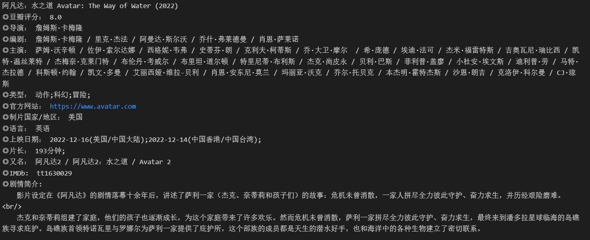
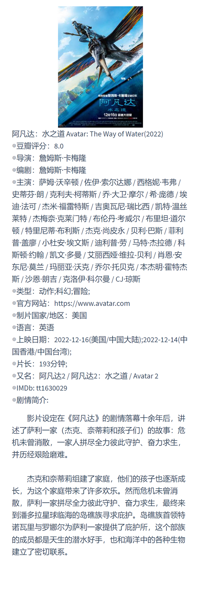
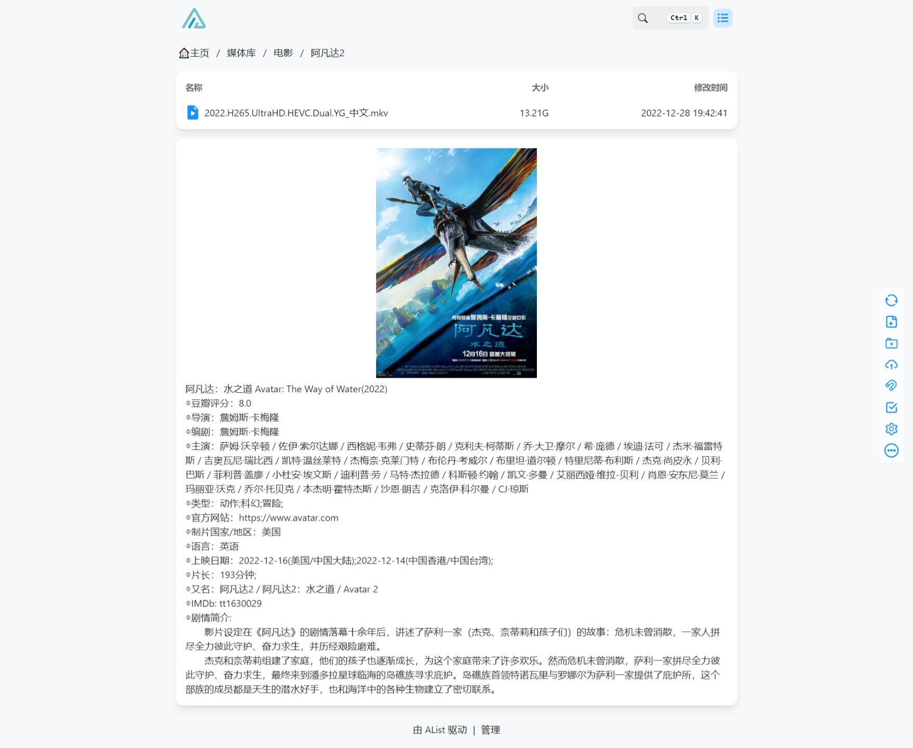

## 前言

爬虫新手，拿来练练手，因此使用了三种数据解析的方法。

加入写入md文件的功能是因为我用Alist建了个媒体库，而且Alist支持markdown文件的渲染。

## 文件内容

`onlyinfo.py`只爬取电影的基本信息，不写入md文件。

`movie2md.py`爬取电影信息，且写入md文件

`series2md.py`爬取电视剧信息，且写入md文件

## 可以爬取的内容

不一定每部电影或电视剧都提供以下内容，如果不提供，将对应的代码注释掉即可。

###  `movie2md.py`

+ 电影名称、发行时间
+ 海报图片
+ 豆瓣平均分
+ 导演
+ 编剧
+ 主演
+ 类型
+ 官方网站
+ 制片国家/地区
+ 语言
+ 上映时间
+ 片长
+ 又名
+ IMDb
+ 电影剧情简介

### `series2md.py`

+ 电视剧名称和年份
+ 海报图片
+ 豆瓣平均分
+ 导演
+ 编剧
+ 主演
+ 类型
+ 制片国家/地区
+ 语言
+ 首播日期
+ 集数
+ 单集片长
+ imdb代码
+ 电视剧剧情简介

## 爬取结果

## markdown文件渲染结果

## 显示在Alist媒体库中的效果

## TODO

+ 无需再复制豆瓣网址，直接输入电影名称即可
+ 爬取热门评论
+ 豆瓣各评分的占比
+ 忽略电影/电视剧没有的信息，只输出有的